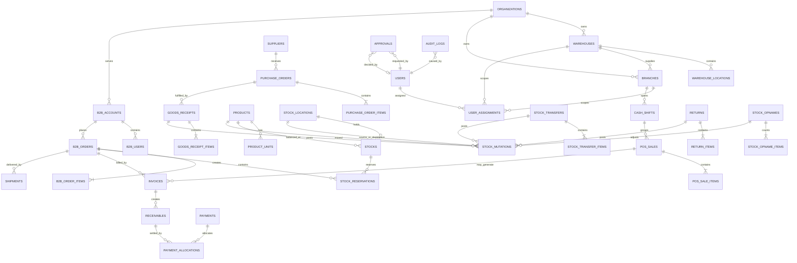

# Software Requirements Specification (SRS)

## 1. Status dan tujuan dokumen

Dokumen ini adalah kontrak analisis implementasi untuk aplikasi Manajemen Gudang, Toko Internal, dan Pelanggan Langganan/B2B. Sumber utama adalah proposal versi "Draft Revisi Fitur & Biaya" sebanyak 33 halaman. Ketentuan yang belum dinyatakan tegas oleh proposal dicatat sebagai keputusan terbuka dan tidak boleh diimplementasikan sebelum disepakati.

Status: **Draft untuk persetujuan bisnis**  
Baseline teknologi: Laravel 12, PHP 8.3+, MySQL/MariaDB, Blade, Bootstrap 5, Metronic 8  
Bahasa UI/dokumentasi pengguna: Indonesia  
Bahasa kode dan skema database: Inggris  
Timezone bisnis: Asia/Jakarta  

## 2. Visi warehouse-first

Gudang adalah sumber kebenaran stok, HPP, harga dasar, dan distribusi. Cabang internal dan pelanggan B2B adalah kanal yang mengambil ketersediaan dari gudang dengan proses berbeda. Semua pergerakan fisik harus berasal dari dokumen bisnis dan menghasilkan mutasi stok append-only. Owner mengawasi performa dan memberi approval strategis, bukan melakukan input operasional harian.

Sasaran utama:

1. Menyediakan stok real-time yang dapat ditelusuri dari saldo sampai dokumen asal.
2. Mencegah penjualan rugi dan overpricing yang merusak kepercayaan pelanggan.
3. Menertibkan pembelian, penerimaan, transfer, POS, order B2B, pengiriman, retur, opname, piutang, dan closing.
4. Memisahkan ownership data gudang, cabang internal, dan pelanggan B2B.
5. Menyediakan audit dan approval untuk tindakan sensitif.

## 3. Batas ruang lingkup MVP

### 3.1 Termasuk MVP

- Autentikasi, akun, role-permission, scope gudang/cabang/B2B.
- Master gudang, cabang, supplier, pelanggan, produk, kategori, satuan, konversi, dan lokasi stok.
- Purchase Order dan Goods Receipt termasuk penerimaan parsial.
- Saldo stok, available stock, reserved stock, dan stock mutation append-only.
- Transfer gudang ke cabang sampai konfirmasi penerimaan.
- HPP, harga minimum, price ring, histori harga, dan approval harga sensitif.
- POS, cash shift, closing, pembayaran dasar, void/reversal, dan retur.
- Portal B2B: katalog, order, reservasi, invoice, pembayaran, shipment, bukti terima, dan retur dasar.
- Piutang B2B dan toko: limit kredit, jatuh tempo, pembayaran parsial, aging, dan blokir/approval.
- Stock opname, freeze opsional, selisih, dan approval koreksi.
- Audit log, approval, laporan stok/penjualan/piutang, dan dashboard owner awal.
- Kehadiran shift minimum yang diperlukan untuk membuka shift POS.

### 3.2 Di luar MVP

- Akuntansi general ledger penuh, payroll, pajak otomatis, marketplace publik, payment gateway, mobile native, perangkat kasir khusus, dan integrasi marketplace.
- Forecasting, PWA/offline POS, rekomendasi pembelian otomatis, peta cabang, analitik supplier lanjutan, dan sistem batch/lot penuh kecuali disepakati sebagai kebutuhan go-live.
- WA/Telegram otomatis dapat masuk fase sesudah transaksi inti stabil; desain harus menyiapkan event dan queue.

## 4. Aktor dan tanggung jawab

| Aktor | Tanggung jawab | Scope data |
|---|---|---|
| `owner` | Dashboard strategis, margin sensitif, audit, approval tertinggi | Seluruh organisasi |
| `super_admin` | Akun, RBAC, konfigurasi, master organisasi | Seluruh organisasi |
| `kepala_gudang` | Operasional gudang, approval stok/receipt/transfer/opname | Gudang yang ditugaskan |
| `staff_gudang` | Receipt, stok, transfer, retur, opname | Gudang yang ditugaskan |
| `picker_packer` | Picking, packing, handover shipment | Gudang yang ditugaskan; margin disembunyikan |
| `purchasing` | Supplier, PO, harga beli sesuai izin | Organisasi/gudang yang ditugaskan |
| `kepala_toko` | Stok, POS, retur, piutang, karyawan, laporan cabang | Cabang yang dipimpin |
| `kasir` | POS, penerimaan pembayaran, buka/tutup shift | Cabang dan shift aktif |
| `supervisor_shift` | Verifikasi shift, approval diskon/void sesuai threshold | Cabang/shift yang ditugaskan |
| `langganan_owner` | Profil usaha, user B2B, order, invoice, pembayaran | Akun B2B sendiri |
| `langganan_staff` | Katalog dan order sesuai delegasi | Akun B2B sendiri |
| `karyawan_toko` | Jadwal, check-in/out, izin, riwayat kehadiran | Data pribadi dan cabang penempatan |

Satu user dapat mempunyai lebih dari satu role, tetapi akses efektif adalah irisan permission dan assignment lokasi. Tidak ada akses lintas lokasi hanya karena mengetahui ID record.

## 5. Matriks role-permission

Legenda: `C` create, `V` view, `U` update sebelum lock, `A` approve, `X` void/reversal, `E` export, `M` view sensitive margin, `-` tidak diizinkan. Semua grant tetap dibatasi scope lokasi/tenant bisnis.

| Role | User/RBAC | Master | Purchase | Inventory | Transfer | Pricing | POS/Shift | B2B | Shipment/Return | Receivable | Attendance | Report/Audit |
|---|---|---|---|---|---|---|---|---|---|---|---|---|
| owner | VAE | VAE | VAM E | VAM E | VAM E | VAM E | VAXME | VAXME | VAXE | VAM E | VAE | VEM |
| super_admin | CVUAE | CVUAE | VE | VE | VE | CVUAE M* | VE | VE | VE | CVUAE | CVUAE | VE* |
| kepala_gudang | - | CVUE | CVUAXE M* | CVUAXE M* | CVUAXE | VUAM* | - | VUAE M* | CVUAXE | CVUAE M* | V | VEM* |
| staff_gudang | - | V | CVUE M* | CVUE | CVUE | V M* | - | VUE | CVUE | CVUE* | V | VE* |
| picker_packer | - | V | V | V | VU | - | - | VU | CVU | - | V | V |
| purchasing | - | CVUE | CVUAXE M* | V E* | V | VU M* | - | - | V | - | V | VEM* |
| kepala_toko | - | VU* | - | VUE | CVUE | V M* | CVUAXE M* | - | CVUAXE | CVUAE M* | CVUAE | VEM* |
| kasir | - | V | - | V | V | V | CVUX* | - | CUX* | CVU* | CV | V* |
| supervisor_shift | - | V | - | VE | V | V M* | CVUAXE M* | - | CVUAXE | CVUAE M* | CVUAE | VEM* |
| langganan_owner | U* | V | - | V available | - | V assigned | - | CVUX* | CVUX* | CV | - | V/E own |
| langganan_staff | - | V | - | V available | - | V assigned | - | CVU* | CVU* | V | - | V own |
| karyawan_toko | U own | V | - | - | - | - | - | - | - | - | CVU own | V own |

`*` berarti bergantung threshold/permission granular yang harus diputuskan. Permission implementasi tidak boleh berupa nama role hard-coded; contoh: `purchase_orders.approve`, `pos_sales.void`, `reports.export`, `margins.view_sensitive`.

## 6. Kebutuhan fungsional lintas modul

- Nomor dokumen unik, tidak boleh dipakai ulang setelah void.
- Semua list memakai pagination server-side, filter lokasi/status/tanggal, eager loading, dan export asynchronous untuk data besar.
- Dokumen mempunyai actor, timestamps bisnis, lokasi, status, version/lock indicator, alasan koreksi, dan jejak approval.
- File upload dibatasi MIME, ukuran, ekstensi, serta disimpan non-public bila sensitif.
- UI admin memakai layout Metronic: sidebar berbasis permission, breadcrumb, toolbar, card, modal, alert/toast, responsive table, filter, empty/loading/error state.
- Semua uang `decimal(18,2)` dan kuantitas `decimal(18,4)`; konversi satuan harus eksplisit dan dibulatkan menurut kebijakan yang disepakati.
- Tanggal ditampilkan konsisten dalam Asia/Jakarta; penyimpanan timestamp mengikuti keputusan pada OQ-01.

## 7. Aturan bisnis invariabel

1. `on_hand_qty`, `available_qty`, dan hasil transaksi keluar tidak boleh negatif.
2. `available_qty = on_hand_qty - reserved_qty - blocked_qty`; seluruh komponen tidak negatif.
3. Perubahan stok dan reservasi menggunakan `DB::transaction`, row-level lock pada saldo terkait, dan idempotency key untuk retry.
4. Setiap perubahan stok menghasilkan satu atau lebih `stock_mutations` append-only berisi produk/unit dasar, lokasi asal/tujuan, dokumen, user, qty sebelum/sesudah, delta, jenis, waktu, dan catatan.
5. Stock mutation tidak boleh di-update/delete. Kesalahan diperbaiki dengan reversal dan mutation baru.
6. Reservasi harus atomik, mempunyai sumber dokumen, kuantitas aktif, dan dilepas saat batal/expired/reject.
7. Harga di bawah minimum ditolak, kecuali kebijakan bisnis secara eksplisit memperbolehkan workflow approval. Approval tidak boleh menghilangkan jejak harga minimum dan alasan.
8. Harga di atas batas wajar memunculkan warning atau membutuhkan approval sesuai threshold, dan selalu masuk laporan overpricing.
9. HPP dan margin transaksi disnapshot pada item transaksi agar laporan historis tidak berubah ketika harga master berubah.
10. Dokumen completed/closed tidak dapat diedit atau dihapus. Koreksi memakai void, reversal, return, credit note, atau adjustment beralasan.
11. Void, diskon besar, override harga, koreksi stok, retur besar, pembayaran sensitif, limit kredit, dan koreksi absensi mengikuti approval policy.
12. Kredit baru tidak boleh membuat exposure melebihi limit atau mengabaikan overdue block tanpa approval aktif.
13. Payment append-only; koreksi menggunakan reversal. Alokasi pembayaran dikunci agar tidak terjadi double allocation.
14. Closing shift mengunci transaksi shift dan memisahkan expected cash, actual cash, non-cash, credit sale, expense, refund, dan variance.
15. Scope warehouse/branch/B2B diverifikasi server-side pada policy dan query, bukan hanya menu/UI.

## 8. Non-functional requirements

### Keamanan dan audit

- Password hash Laravel, throttling login, CSRF, secure session cookie, dan 2FA direkomendasikan untuk owner/super admin.
- Audit log memuat actor, action, auditable, before/after yang disanitasi, IP, user-agent, request/correlation ID, waktu, dan lokasi bisnis.
- Secret WA/Telegram dienkripsi dan tidak pernah tampil penuh atau masuk log.
- Backup dan restore drill wajib didefinisikan sebelum go-live.

### Konsistensi dan konkurensi

- Endpoint mutasi finansial/stok harus idempotent.
- Lock order konsisten untuk mencegah deadlock; transaksi sesingkat mungkin.
- Constraint/index database menjadi lapisan pertahanan tambahan, bukan pengganti validasi domain.

### Kinerja

- Target awal (perlu konfirmasi beban): halaman transaksi umum p95 <= 2 detik dan pencarian produk POS p95 <= 500 ms pada jaringan lokal yang sehat.
- Export, notifikasi, generate dokumen, dan laporan berat melalui queue.
- Index minimal mencakup nomor dokumen, status, tanggal, foreign key, produk-lokasi, customer-due date, dan assignment scope.

## 9. ERD konseptual dan ownership

Ownership rules:

- Organization adalah boundary tertinggi walaupun MVP mungkin hanya satu organisasi.
- Warehouse memiliki lokasi fisik dan saldo gudang. Branch memiliki saldo terpisah dan tidak berbagi row stock dengan warehouse.
- Sumber/tujuan stok dimodelkan sebagai stock location yang typed agar transfer konsisten, tetapi foreign key bisnis warehouse/branch tetap eksplisit untuk reporting dan authorization.
- B2B account hanya memiliki profil, user, order, alamat, invoice, pembayaran, dan retur miliknya; tidak memiliki akses saldo internal. Katalog hanya mengekspos available stock sesuai kebijakan.
- Dokumen transaksi dimiliki organisasi serta lokasi operasional pembuat/pemenuh; ownership tidak berubah setelah posting.

## 10. Asumsi kerja yang aman

- Aplikasi adalah modular monolith dan satu deployment/database pada MVP.
- Satu cabang dipasok oleh satu gudang default, tetapi dokumen dapat memilih gudang lain jika diberi izin.
- Semua qty dinormalisasi ke base unit saat posting stok, sementara unit input dan conversion snapshot disimpan.
- Approval bersifat record terpisah dan tidak mengubah dokumen sebelum keputusan sah.
- Seeder demo hanya boleh berjalan pada environment local/testing.

## 11. Keputusan bisnis terbuka

| ID | Keputusan yang dibutuhkan | Dampak |
|---|---|---|
| OQ-01 | Timestamp disimpan UTC lalu ditampilkan Asia/Jakarta, atau disimpan lokal? Rekomendasi: UTC. | Konsistensi laporan/integrasi |
| OQ-02 | Metode HPP: weighted moving average, FIFO, atau last purchase price? Biaya apa yang dikapitalisasi? | Margin, valuasi, retur |
| OQ-03 | Apakah penjualan di bawah minimum benar-benar dapat di-approve? Siapa dan sampai batas berapa? | Risiko kerugian |
| OQ-04 | Formula minimum price dan overpricing per kategori/ring; persentase vs nominal. | Validasi POS/B2B |
| OQ-05 | Kapan stok transfer berkurang/bertambah: saat dispatch dan receipt, serta apakah perlu in-transit stock? | Akurasi ownership stok |
| OQ-06 | Kapan stok B2B berkurang: packing, dispatch, atau delivery? | Reservasi dan COGS |
| OQ-07 | Masa berlaku reservasi dan aturan partial fulfillment/backorder. | Ketersediaan stok |
| OQ-08 | Threshold nominal/persentase untuk approval per aksi dan escalation chain. | RBAC/workflow |
| OQ-09 | Kebijakan credit limit: exposure mencakup order reserved, invoice, cheque, dan overdue berapa hari? | Blokir order/piutang |
| OQ-10 | Refund POS dan retur B2B: cash, credit note, replacement, serta treatment HPP. | Kas, stok, piutang |
| OQ-11 | Metode pembayaran, fee, dan rekonsiliasi bank/QRIS yang masuk MVP. | Closing/accounting |
| OQ-12 | Aturan shift lintas tengah malam, toleransi, offline attendance, PIN/QR/foto/lokasi. | Absensi dan POS |
| OQ-13 | Apakah batch/lot wajib pada go-live dan apakah barang pecah/rusak tetap bernilai stok? | Model inventory |
| OQ-14 | Nomor dokumen, reset sequence, timezone cutoff, dan kebutuhan multi-company. | Skema dan audit |
| OQ-15 | Format pajak, invoice, struk, surat jalan, tanda tangan, dan legal retention period. | Dokumen/legal |
| OQ-16 | Provider WA, recipient, jadwal, retry, consent, dan masa berlaku secure report link. | Integrasi/notifikasi |
| OQ-17 | Volume: jumlah produk/SKU, gudang, cabang, user bersamaan, transaksi harian, dan ukuran import. | Capacity planning |
| OQ-18 | RPO/RTO backup, retensi audit, dan pihak yang boleh melakukan restore. | Operasional keamanan |

## 12. Definition of Done kontrak

Analisis dianggap disepakati setelah pemilik bisnis menyetujui scope MVP, glossary, matriks permission, state machine, ERD ownership, backlog/acceptance criteria, serta memberi keputusan atau secara eksplisit menunda setiap pertanyaan terbuka yang memblokir fase aktif.

