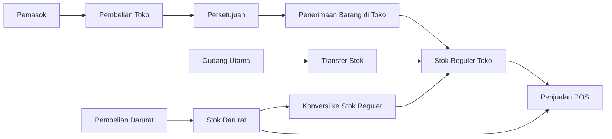

# Pembelian Langsung dan Persediaan Toko

Dokumen ini menjelaskan keputusan bisnis, kewenangan, serta dampak stok untuk barang yang diterima toko tanpa melewati gudang utama. Ruang lingkupnya adalah toko internal dan POS.

## Prinsip persediaan

Toko memiliki satu saldo stok reguler berdasarkan `work_location_id` cabang. Barang di gudang belakang dan area pajang masih menjadi satu saldo reguler; lokasi pajang merupakan informasi etalase dan tidak membentuk saldo persediaan lain.

Barang dapat masuk ke toko melalui tiga jalur:

1. Pembelian langsung dari pemasok melalui PO dan penerimaan barang tujuan toko.
2. Transfer dari gudang utama melalui permintaan restock dan penerimaan transfer.
3. Pembelian darurat yang disimpan sebagai lot terpisah sampai terjual, diretur, diteruskan, atau dikonversi ke stok reguler.

## Pembelian langsung toko

Kepala toko membuat Purchase Order dan memilih `Cabang/Toko` sebagai lokasi penerima. PO hanya dapat dibuat untuk lokasi yang termasuk penugasan pengguna. Persetujuan tetap dilakukan kepala gudang atau approver pusat agar pembuat PO tidak menyetujui dokumennya sendiri.

Setelah barang tiba, kepala toko membuat penerimaan dari PO tersebut. Kuantitas datang dibagi menjadi diterima baik, ditolak, rusak, atau dikembalikan ke supplier. Lokasi rak gudang tidak dapat dipilih pada penerimaan tujuan toko.

Saat penerimaan diposting:

- stok reguler bertambah pada `work_location_id` toko;
- stok gudang utama tidak berubah;
- mutasi stok, batch, QC, histori biaya, dan evaluasi supplier tetap dibuat;
- HPP produk diperbarui dengan metode rata-rata bergerak;
- PO diperbarui menjadi diterima sebagian atau selesai.

## Pengajuan produk baru

Staf atau kepala toko menggunakan `/retail/pengajuan-produk` ketika barang belum tersedia di master produk. Data minimal meliputi nama, kategori, satuan dasar, harga beli, dan usulan harga jual. SKU dan barcode dapat diajukan oleh toko.

Sistem memeriksa nama, SKU, dan barcode terhadap produk yang sudah ada. Admin master data atau kepala gudang kemudian menyetujui atau menolak pengajuan. Persetujuan membuat:

- master produk aktif;
- SKU otomatis jika toko tidak mengusulkannya;
- satuan dasar dan barcode;
- harga retail khusus toko pengaju;
- hubungan produk dengan supplier jika supplier diisi.

Produk baru hanya dapat dimasukkan ke PO setelah pengajuan disetujui.

## Konversi stok darurat

Pembelian darurat tidak otomatis menambah stok reguler. POS menggunakan stok dalam urutan stok reguler, barang yang terikat pada permintaan pelanggan, kemudian pool darurat toko.

Kepala toko dapat memilih **Masukkan Saldo Bebas ke Stok Reguler Toko** pada detail pembelian darurat. Sistem mengunci lot, mengecualikan saldo yang sedang dicadangkan, menambah stok reguler, memperbarui HPP berdasarkan biaya lot, dan mencatat mutasi serta riwayat tindakan. Tindakan yang sama tidak dapat menambah stok dua kali.

## Matriks kewenangan

| Tindakan | Staf toko | Kasir | Kepala toko | Kepala gudang/Admin |
|---|---:|---:|---:|---:|
| Mengajukan produk baru | Ya | Tidak | Ya | Lihat/periksa |
| Membuat PO tujuan toko | Tidak | Tidak | Ya | Sesuai permission |
| Menyetujui PO tujuan toko | Tidak | Tidak | Tidak | Ya |
| Memposting penerimaan toko | Tidak | Tidak | Ya | Sesuai lokasi |
| Membeli barang darurat | Tidak | Ya | Ya | Tidak |
| Konversi saldo darurat bebas | Tidak | Tidak | Ya | Sesuai permission |

## Ketentuan audit

- Dokumen yang sudah diposting tidak dihapus atau diedit langsung.
- Penerimaan supplier tidak dicatat sebagai koreksi stok.
- Semua pembatasan lokasi memakai lokasi kerja pengguna.
- Stok darurat tetap terpisah sampai terjadi penjualan atau konversi resmi.
- Database lokal aktif tidak boleh di-reset untuk menguji migrasi; gunakan lingkungan testing terisolasi.

## Diagram pada panduan aplikasi

Panduan Toko Internal menampilkan diagram untuk setiap fitur operasional. Sumber teks tetap berada di `guide/toko-internal.md`, sedangkan definisi diagram dan daftar file backend acuannya berada di `config/guide-flows.php`. Renderer server-side berada di `RoleGuideService` dan partial `resources/views/guides/partials/workflow.blade.php`, sehingga diagram tidak memerlukan CDN atau library JavaScript tambahan.

Tes `RoleGuideTest` memastikan:

- setiap penanda diagram dalam panduan berhasil dirender;
- seluruh diagram terdaftar benar-benar digunakan oleh panduan;
- setiap diagram memiliki lane, langkah, dan sumber verifikasi backend;
- semua file backend yang dijadikan acuan masih tersedia.

Jika alur service, controller, policy, atau route berubah, definisi diagram terkait wajib diperbarui bersama panduan agar instruksi operasional tetap sama dengan perilaku aplikasi.
