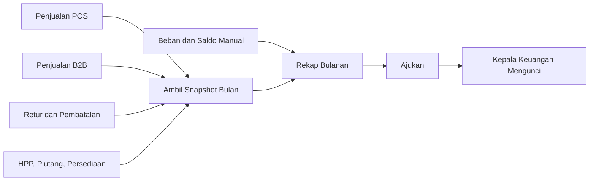
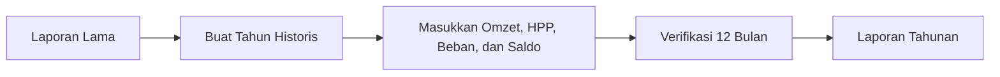
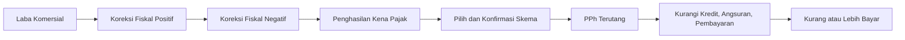
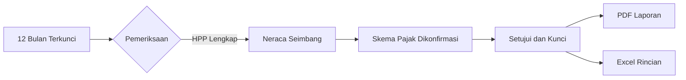

# Keuangan & Pajak Tahunan

Modul `/tax` adalah pembukuan sederhana untuk perusahaan non-PKP. Tujuannya menyiapkan Laba Rugi, Neraca, rekonsiliasi fiskal, dan estimasi PPh Badan tahunan. Pelaporan resmi tetap dilakukan melalui Coretax.

## Role

- `staf_keuangan`: membuat tahun laporan, mengambil snapshot transaksi, mencatat saldo/input manual, dan mengajukan rekap.
- `kepala_keuangan`: memeriksa, mengunci atau membuka bulan, mengonfirmasi skema PPh, menyetujui serta mengunci laporan tahunan.
- `owner_viewer` dan `owner_approver`: membaca dan mengunduh PDF/Excel.
- `super_admin`: akses administratif darurat.

## Alur bulanan

1. Buat tahun laporan. Sistem menyiapkan Januari sampai Desember.
2. Pada tab Rekap Bulanan, klik **Ambil Snapshot**. Angka otomatis disimpan agar tidak berubah saat transaksi berikutnya bertambah.
3. Tambahkan gaji, sewa, listrik/air, saldo neraca, atau koreksi. Nominal manual tidak menimpa sumber otomatis; alasan wajib diisi dan bukti boleh dilampirkan.
4. Ajukan bulan, lalu Kepala Keuangan memeriksa dan menguncinya.
5. Bulan terkunci hanya dapat dibuka Kepala Keuangan dengan alasan.

## Data historis

Centang **Data historis** untuk tahun sebelum aplikasi digunakan. Masukkan angka melalui akun penyesuaian. Jangan membuat transaksi POS palsu.

## PPh Badan

Pilihan skema: PPh Final 0,5% omzet, fasilitas Pasal 31E, tarif umum, atau nominal manual dari konsultan/Coretax. Tarif dan batas omzet tersimpan pada tahun laporan agar laporan terkunci tidak berubah oleh aturan masa depan.

## Penutupan tahunan

Laporan tidak dapat disetujui bila ada bulan terbuka, HPP belum lengkap, neraca tidak seimbang, identitas penandatangan belum lengkap, atau skema pajak belum dikonfirmasi. PDF menyediakan identitas perusahaan dan ruang tanda tangan Komisaris/Direktur. Excel memuat ringkasan, rincian bulanan, sumber otomatis, input manual, dan rekonsiliasi fiskal.

## Data pajak lama

Tabel profil, aturan, masa, dan dokumen pajak lama tetap disimpan sebagai histori read-only. Nilai pajak yang sudah menjadi snapshot transaksi tidak diubah. Kalkulasi PPN baru dinonaktifkan karena perusahaan berstatus non-PKP, dan masa pajak lama tidak dimasukkan otomatis ke PPh tahunan.
