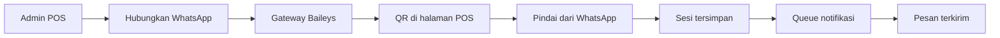

# Integrasi WhatsApp Gateway

Aplikasi memakai satu sesi WhatsApp perusahaan pada gateway Baileys. Super Admin dan Admin Config mengelolanya melalui menu **Koneksi WhatsApp** (`/admin/integrasi/whatsapp`). API key hanya digunakan oleh Laravel dan tidak pernah dikirim ke browser.

## Konfigurasi

Tambahkan ke `.env` aplikasi POS:

```env
WA_GATEWAY_ENABLED=true
WA_GATEWAY_BASE_URL=http://127.0.0.1:3000
WA_GATEWAY_API_KEY=isi_dengan_kunci_yang_sama_di_gateway
WA_GATEWAY_SESSION_ID=gudangtoko-main
WA_GATEWAY_TIMEOUT=10
NOTIFICATION_DRY_RUN=false
```

Tambahkan ke `.env` gateway:

```env
WA_API_KEY=isi_dengan_kunci_yang_sama_di_pos
POS_WA_SESSION_ID=gudangtoko-main
SESSION_DIR=./sessions
```

`SESSION_DIR` wajib berada pada disk persisten dan mempunyai izin tulis. Jangan menghapus folder ini saat deployment karena berisi kredensial perangkat tertaut.

## Menjalankan layanan

```powershell
cd C:\laragon\www\billey-waapi-v2
npm.cmd run start

cd C:\laragon\www\super-app-pos
php artisan queue:work database --queue=default --tries=3 --timeout=120
```

Worker queue wajib aktif agar pesan berstatus **Dalam Antrian** diproses. Halaman Koneksi WhatsApp menampilkan 10 pengiriman terbaru langsung dari server, lalu memperbarui status antrean, percobaan ulang, gagal, serta terkirim secara otomatis. Kolom **Penerima** memakai akun aktual yang nomor WhatsApp-nya cocok; nomor yang belum terhubung ke akun ditandai sebagai **Nomor eksternal**. Informasi yang sama tersedia pada menu **Log Pengiriman**.

Status **Terkirim** berarti gateway WhatsApp telah menerima pesan dan mengembalikan ID pesan. Jika gateway sementara tidak dapat dijangkau, job masuk percobaan ulang sesuai jeda queue.

Setelah gateway aktif, buka halaman koneksi, klik **Hubungkan WhatsApp**, lalu pindai QR dari menu **Perangkat tertaut** pada WhatsApp. Gangguan jaringan atau restart gateway akan memakai kembali sesi tersimpan. Saat status terhubung, tombol utama otomatis berubah menjadi **Putuskan WhatsApp**. Tombol tersebut melakukan logout, membersihkan identitas koneksi tersimpan di POS, menonaktifkan channel pengiriman, dan mengembalikan tombol menjadi **Hubungkan WhatsApp**.

Gunakan **Sambungkan Ulang** hanya ketika status koneksi menunjukkan gangguan. Pengaturan jenis pesan berada pada menu **Aktif/Nonaktif Notifikasi** (`/admin/notifications/pengaturan-bisnis`).

Scheduler aplikasi perlu aktif bersama queue worker. Scheduler memeriksa stok, piutang, order tertunda, dan mengirim laporan owner pukul 21.00 Asia/Jakarta. Laporan owner juga diantrikan setelah kepala toko atau kepala gudang menyelesaikan checklist hariannya. Pesan laporan menyertakan tautan Dashboard Owner, Laporan Harian, dan Dashboard Toko yang dapat dibuka setelah login.



## Pemecahan masalah

- **Gateway tidak dapat dijangkau:** pastikan proses Node aktif dan `WA_GATEWAY_BASE_URL` benar.
- **QR kedaluwarsa:** klik **Minta QR Baru / Sambungkan Ulang**.
- **Status tidak terhubung setelah restart:** pastikan `SESSION_DIR` tidak berubah dan masih berisi folder `gudangtoko-main`.
- **Pesan hanya berstatus dilewati:** ubah `NOTIFICATION_DRY_RUN=false` dan jalankan queue worker.
- **Pesan gagal:** periksa Log Pengiriman dan Kesehatan Sistem tanpa menyalin API key ke log.
