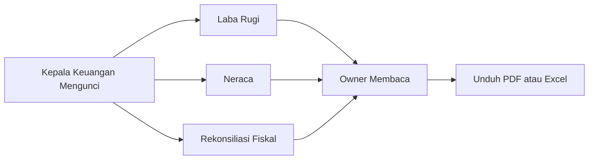

# Guide Book Owner

> Panduan penyusunan KPI, persetujuan hasil, dan pencatatan pembayaran tersedia pada [Panduan Target dan Bonus Staf](target-bonus.md).

Panduan ini untuk `owner_viewer` dan `owner_approver`. Dalam praktik bisnis, owner melihat kondisi seluruh organisasi, mengambil keputusan strategis, dan menyetujui transaksi sensitif. Owner tidak disarankan melakukan input operasional harian kecuali sebagai tindakan supervisi.

## 1. Tujuan role Owner

Owner memakai aplikasi untuk menjawab pertanyaan bisnis besar:

- Apakah stok cukup dan sehat?
- Apakah penjualan toko dan B2B menguntungkan?
- Apakah HPP, margin, dan harga jual aman?
- Apakah piutang tertagih tepat waktu?
- Apakah ada transaksi janggal?
- Apakah approval tertunda berisiko menghambat operasional?
- Apakah supplier, gudang, toko, dan pelanggan berjalan sesuai target?

Role terkait:

| Role | Fokus |
|---|---|
| `owner_viewer` | Melihat dashboard, laporan, audit, margin sensitif, dan export tanpa approval. |
| `owner_approver` | Semua akses owner viewer ditambah hak approve untuk aksi sensitif. |

```guide-flow
owner-responsibilities
```

## 2. Menu utama Owner

| Menu | URL | Fungsi |
|---|---|---|
| Dashboard Owner | `/owner/dashboard` | Ringkasan omzet, margin, stok, piutang, approval, anomali, dan performa. |
| Laporan Harian Owner | `/reports/daily` | Laporan harian ringkas untuk pengambilan keputusan cepat. |
| Laporan Gudang | `/reports/warehouse` | Kondisi stok, mutasi, stok kritis, transfer, dan nilai persediaan. |
| Laporan Toko | `/reports/retail` | Penjualan POS, closing shift, kas, refund, dan performa cabang. |
| Laporan B2B | `/reports/b2b` | Order pelanggan langganan, invoice, pengiriman, dan status pembayaran. |
| Laporan Harga & Margin | `/reports/pricing` | Analisis margin, HPP, harga minimum, dan harga jual. |
| Laporan Supplier | `/reports/suppliers` | Ketepatan supplier, kualitas penerimaan, tren harga, dan evaluasi. |
| Laporan Piutang | `/reports/receivables` | Aging, overdue, limit kredit, pembayaran, dan saldo tagihan. |
| Pusat Export | `/reports/exports` | Melihat dan mengunduh hasil export laporan. |
| Kotak Masuk Approval | `/approvals` | Menyetujui atau menolak aksi sensitif. |
| Audit Log | `/audit-logs` | Melihat jejak aktivitas pengguna dan perubahan penting. |
| Dashboard Anomali | `/audit/anomalies` | Meninjau alert risiko. |
| Log Login & Keamanan | `/audit/security` | Memantau login, gagal login, dan kejadian keamanan. |
| Invoice | `/invoices` | Melihat invoice dan PDF tagihan. |
| Dashboard Piutang | `/receivables/dashboard` | Ringkasan saldo piutang dan aging. |
| Limit Kredit | `/receivables/credit-limits` | Meninjau atau menyetujui perubahan limit sesuai izin. |
| Performa Sales | `/sales/performance` | Membandingkan target dan realisasi seluruh tim Sales. |
| Keuangan & Pajak Tahunan | `/tax` | Membaca Laba Rugi, Neraca, rekonsiliasi PPh, serta mengunduh PDF/Excel. |

```guide-flow
owner-overview
```

## 3. Alur kerja harian Owner

### 3.1 Buka dashboard owner

1. Login melalui `/login`.
2. Buka `Dashboard Owner`.
3. Periksa KPI utama:
   - omzet/revenue,
   - gross margin,
   - persentase margin,
   - nilai stok,
   - transaksi hari ini,
   - stok kritis,
   - produk fast moving dan slow moving,
   - total piutang,
   - piutang overdue,
   - selisih kas,
   - kehadiran terlambat,
   - approval tertunda,
   - anomali terbuka,
   - nilai retur.
4. Klik kartu KPI untuk masuk ke laporan detail bila tersedia.

Cara kerja di belakang layar:

- Dashboard mengambil data dari transaksi yang sudah berstatus final atau posted.
- Margin dihitung dari snapshot transaksi, bukan dari harga master terbaru.
- Data dibatasi oleh permission `reports.view` dan `margins.view_sensitive`.
- Export laporan diproses melalui data report export agar file tidak membebani request utama.

```guide-flow
owner-dashboard
```

Gunakan laporan harian, gudang, toko, B2B, pricing, supplier, dan piutang untuk memeriksa penyebab indikator dashboard. Terapkan periode dan lokasi yang sama agar perbandingan tetap konsisten, lalu buka dokumen transaksi sumber sebelum mengambil keputusan.

```guide-flow
owner-report-review
```

### 3.2 Cek approval tertunda

1. Buka `/approvals`.
2. Filter status `pending`, modul, tingkat risiko, atau pemohon.
3. Buka detail approval.
4. Baca:
   - pemohon,
   - jenis dokumen,
   - nilai risiko,
   - data sebelum dan sesudah,
   - alasan user,
   - dampak stok/uang/harga.
5. Klik `Approve` jika valid atau `Reject` jika tidak valid.
6. Isi alasan keputusan dengan bahasa jelas.

Cara kerja di belakang layar:

- Route keputusan memeriksa permission `approvals.approve`, lalu service memeriksa permission/role yang diwajibkan request, masa berlaku, lokasi tertentu, dan pemisahan tugas.
- Keputusan, langkah approver, waktu, catatan, dan audit log disimpan.
- Untuk aksi stok/uang, proses final dijalankan dalam transaksi database.
- Jika aturan pemisahan tugas aktif, pemohon tidak boleh memutuskan request sendiri.

Kotak masuk terpusat saat ini digunakan oleh:

- harga produk atau harga khusus yang memerlukan approval;
- pembelian darurat toko yang terkena aturan approval.

Approval Purchase Order, stok opname, retur, credit note, limit kredit, dan closing shift dilakukan dari halaman modul masing-masing. Void POS dijalankan langsung oleh pengguna dengan permission `pos.void` dan tidak masuk antrean approval.

```guide-flow
owner-approval-inbox
```

### 3.3 Cek laporan stok dan gudang

1. Buka `/reports/warehouse` atau `/warehouse/stocks`.
2. Filter gudang, cabang, kategori, atau status stok.
3. Periksa stok kosong, stok kritis, reserved stock, damaged stock, dan nilai stok.
4. Untuk produk bermasalah, buka kartu stok `/warehouse/stock-card`.
5. Cocokkan saldo berjalan dengan dokumen asal.

Cara kerja di belakang layar:

- Saldo stok berasal dari tabel `stocks`.
- Detail riwayat berasal dari `stock_mutations` yang append-only.
- Available stock dihitung dari on hand dikurangi reserved dan damaged.
- Mutasi tidak boleh dihapus. Koreksi harus melalui dokumen adjustment, retur, loss, atau reversal.

```guide-flow
owner-stock-review
```

### 3.4 Cek margin dan harga

1. Buka `/reports/pricing`.
2. Buka juga:
   - `/pricing/product-prices`,
   - `/pricing/rules`,
   - `/pricing/history`,
   - `/pricing/hpp-history`,
   - `/pricing/simulator`.
3. Periksa produk dengan margin rendah, overpricing, atau perubahan HPP tajam.
4. Bila ada request harga, buka `/pricing/approvals`.

Cara kerja di belakang layar:

- Harga jual disimpan per produk, cabang/channel, price ring, dan periode aktif.
- HPP berasal dari penerimaan barang dan histori biaya.
- Transaksi POS/B2B menyimpan snapshot HPP dan harga agar laporan historis stabil.
- Perubahan harga sensitif bisa memicu approval.

```guide-flow
owner-pricing-review
```

### 3.5 Cek piutang

1. Buka `/receivables/dashboard`.
2. Periksa total outstanding, overdue, aging bucket, dan pelanggan risiko tinggi.
3. Buka `/receivables` untuk daftar detail.
4. Buka detail pelanggan untuk histori invoice, pembayaran, ledger, dan reminder.
5. Untuk `owner_approver`, buka `/receivables/credit-limits` jika perlu mengelola limit atau status blokir.

Cara kerja di belakang layar:

- Piutang dibuat dari invoice B2B issued atau bagian kredit pada transaksi POS.
- Pembayaran dicatat sebagai payment dan dialokasikan ke invoice/piutang.
- Saldo piutang berasal dari ledger receivable entry, bukan angka manual bebas.
- Credit note atau adjustment harus diaudit dan bisa membutuhkan approval.

`owner_viewer` dapat melihat laporan dan detail piutang, tetapi tidak dapat membuka pengelolaan limit kredit karena halaman itu memerlukan permission `receivables.manage_limits`.

```guide-flow
owner-receivable-review
```

### 3.6 Cek audit dan anomali

1. Buka `/audit/anomalies`.
2. Prioritaskan severity tinggi.
3. Buka detail evidence.
4. Jika anomali valid, minta tim terkait memperbaiki dengan dokumen koreksi.
5. Tetapkan status `Reviewed`, `Resolved`, atau `False Positive` dengan catatan sesuai hasil pemeriksaan.
6. Buka `/audit-logs` untuk jejak perubahan record.

Cara kerja di belakang layar:

- Audit log menyimpan actor, event, module, before/after, IP/user-agent bila tersedia, dan waktu.
- Anomaly alert dibuat dari aturan risiko, misalnya diskon besar, void, perubahan harga, atau aktivitas login.
- Resolve anomali tidak mengubah transaksi asal; resolve hanya menandai alert sudah ditinjau.

```guide-flow
owner-audit-review
```

### 3.7 Meninjau performa Sales

1. Buka `/sales/performance`.
2. Pilih bulan dan tahun.
3. Bandingkan performa seluruh Sales, target, pencapaian, dan nilai bonus.
4. Telusuri penyimpangan melalui order dan pelanggan terkait.
5. Tetapkan tindak lanjut tanpa mengambil alih transaksi harian Sales.

Gunakan halaman performa tim, bukan `/sales/dashboard`, karena dashboard tersebut menghitung data milik pengguna Sales yang sedang login.

```guide-flow
owner-sales-review
```

### 3.8 Meninjau Keuangan & Pajak Tahunan

Owner Viewer dan Owner Approver membaca laporan tanpa melakukan persetujuan operasional.

1. Buka `/tax` dan pilih tahun laporan.
2. Periksa Ringkasan Tahun, Laba Rugi, dan Neraca.
3. Pastikan 12 bulan terkunci, HPP lengkap, skema pajak telah dikonfirmasi Kepala Keuangan, dan selisih neraca nol.
4. Baca rekonsiliasi fiskal, PPh terutang, kredit pajak, serta kurang/lebih bayar.
5. Unduh PDF untuk dokumen bertanda tangan dan Excel untuk penelusuran rinci.



Panduan rinci tersedia di [Keuangan & Pajak Tahunan](../docs/TAX.md).

### 3.9 Meminta export laporan

1. Buka `/reports/exports`.
2. Pilih jenis laporan, format, periode, lokasi, dan filter yang diperlukan.
3. Kirim permintaan export.
4. Tunggu status pemrosesan selesai oleh queue worker.
5. Unduh file dari pusat export sebelum masa berlakunya habis.

Export berjalan melalui job antrean dan memiliki masa berlaku tujuh hari. File belum dapat diunduh jika proses belum menghasilkan file di storage.

```guide-flow
owner-report-export
```

## 4. Panduan membaca status

### 4.1 Purchase Order

| Status | Arti |
|---|---|
| Draft | PO masih disiapkan. |
| Submitted | PO diajukan untuk approval. |
| Approved | PO disetujui dan siap dikirim ke supplier. |
| Sent to Supplier | PO sudah dikirim ke supplier. |
| Partially Received | Sebagian item sudah diterima. |
| Completed | PO selesai diterima. |
| Cancelled | PO dibatalkan sebelum ada qty barang yang diterima. |

```guide-flow
owner-po-status
```

### 4.2 Goods Receipt

| Status | Arti |
|---|---|
| Draft | Penerimaan belum diposting. |
| Posted | Stok dan HPP sudah diperbarui. |
| Cancelled | Penerimaan dibatalkan sesuai alur yang tersedia. |

Goods Receipt tidak memiliki status `Corrected` atau `Reversed`. Receipt Posted tidak diedit langsung; koreksi dilakukan melalui dokumen stok/retur/reversal yang sesuai.

```guide-flow
owner-receipt-status
```

### 4.3 Transfer

| Status | Arti |
|---|---|
| Draft/Pending Approval | Belum mengurangi stok. |
| Approved/Packing | Stok sumber di-reserve. |
| Shipped | Stok sumber keluar/in transit. |
| Partially Received | Sebagian diterima tujuan. |
| Fully Received/Completed | Transfer selesai. |
| Cancelled | Dibatalkan sesuai aturan status. |

```guide-flow
owner-transfer-status
```

### 4.4 POS dan Shift

| Status | Arti |
|---|---|
| Shift Open | Kasir boleh transaksi. |
| Closing Submitted | Kasir sudah submit closing; menunggu supervisor. |
| Approved/Closed | Closing terkunci. |
| Rejected | Closing perlu diperbaiki sesuai catatan. |

```guide-flow
owner-shift-status
```

## 5. Hal yang tidak boleh dilakukan Owner

- Jangan menyuruh tim mengubah saldo stok langsung di database.
- Jangan approve transaksi tanpa membaca alasan dan dampaknya.
- Jangan memakai akun Super Admin untuk pekerjaan owner harian.
- Jangan menghapus transaksi final untuk "merapikan data".
- Jangan menjalankan seeder demo di production.
- Jangan mengabaikan piutang overdue yang tetap diberi order baru tanpa approval jelas.

```guide-flow
owner-guardrails
```

## 6. Checklist harian Owner

- [ ] Dashboard owner sudah diperiksa.
- [ ] Approval pending diputuskan atau didelegasikan.
- [ ] Stok kritis/kosong ditindaklanjuti.
- [ ] Margin rendah dan harga tidak wajar ditinjau.
- [ ] Piutang overdue dipantau.
- [ ] Anomali high severity ditinjau.
- [ ] Export/laporan penting sudah diunduh bila diperlukan.

```guide-flow
owner-daily
```

## 7. Checklist mingguan Owner

- [ ] Evaluasi performa supplier.
- [ ] Evaluasi performa cabang.
- [ ] Evaluasi produk slow moving dan fast moving.
- [ ] Evaluasi loss, retur, void, dan koreksi stok.
- [ ] Evaluasi limit kredit pelanggan B2B.
- [ ] Review backup dan health system bersama Super Admin.

```guide-flow
owner-weekly
```

## 8. Mencatat dan memantau checklist

Gunakan menu **Checklist Kerja** (`/checklist-kerja`) untuk mengisi checklist Owner. Tab **Rekap Tim** menampilkan kepatuhan seluruh akun dan lokasi. Rincian status, perhitungan, serta pengaturan versi tersedia pada [Panduan Checklist Kerja](checklist-kerja.md).

```guide-flow
checklist-recap
```

## 9. Verifikasi kehadiran kepala lokasi

Owner Approver membuka menu **Kehadiran** (`/attendance`) untuk memeriksa absensi Kepala Toko dan Kepala Gudang setelah jam pulang tercatat. Owner Viewer hanya dapat melihat data. Persetujuan dan penolakan tidak mengubah waktu asli; penolakan wajib disertai alasan agar koreksi dapat ditelusuri.

```guide-flow
attendance-verification
```
