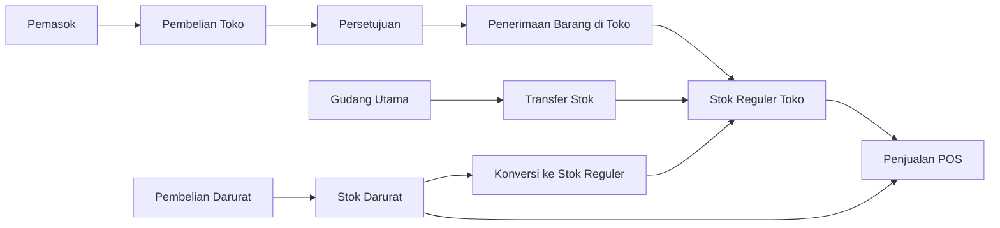

# Guide Book Toko Internal

> Target cabang, nilai staf toko dan kasir, serta rekap kepala toko dijelaskan pada [Panduan Target dan Bonus Staf](target-bonus.md).

Panduan ini untuk `kepala_toko`, `staf_toko`, `kasir`, `supervisor_shift`, dan karyawan toko. Fokus utama toko internal adalah pelayanan pelanggan, penjualan POS, pembelian langsung toko, pengajuan produk baru, pengelolaan stok reguler dan darurat, shift kasir, retur pelanggan, piutang toko, dan kehadiran.

## 1. Tujuan role Toko Internal

| Role | Fokus |
|---|---|
| `kepala_toko` | Mengawasi cabang, stok toko, pembelian langsung, pengajuan produk, konversi stok darurat, POS, shift, retur, piutang, dan karyawan. |
| `staf_toko` | Melayani pelanggan dengan mencari produk, harga POS, stok siap jual, dan lokasi pajang toko penugasan. Tidak dapat memproses pembayaran atau mengubah lokasi pajang. |
| `kasir` | Membuka shift, melakukan transaksi POS, menerima pembayaran, dan submit closing. |
| `supervisor_shift` | Memantau closing, void, dan operasional shift tanpa otoritas approval kepala bagian. |
| Karyawan toko | Check-in/out, jadwal, izin, dan aktivitas toko sesuai tugas. |

## 2. Menu utama Toko Internal

| Menu | URL | Fungsi |
|---|---|---|
| Etalase Produk Toko | `/retail/etalase` | Daftar produk tersedia, harga POS, dan area/rak/tingkat pajang di toko penugasan. Menjadi halaman awal `staf_toko`. Kepala toko mengisi lokasi pajang melalui kartu produk. |
| Dashboard Cabang | `/retail/dashboard` | KPI penjualan, shift, transaksi, dan performa cabang. |
| Kasir POS | `/retail/pos` | Input penjualan toko. |
| Checkout POS | `/retail/pos/checkout` | Penyelesaian pembayaran POS. |
| Pembelian Darurat | `/retail/pembelian-darurat` | Konfirmasi kebutuhan pelanggan, restok proaktif, catat nota, dan pantau pool darurat. |
| Laporan Darurat Toko | `/retail/pembelian-darurat/laporan` | Biaya, saldo pool, dampak margin, dan kejadian kehabisan stok per toko. |
| Pengajuan Produk Baru | `/retail/pengajuan-produk` | Mengusulkan produk yang belum ada, lalu menunggu pemeriksaan master data. |
| Purchase Order | `/purchasing/purchase-orders` | Kepala toko membuat PO dengan lokasi penerima toko; approver pusat tetap menyetujui PO. |
| Penerimaan Barang | `/warehouse/goods-receipts` | Kepala toko mencatat dan memposting barang supplier yang diterima langsung di toko. |
| Transaksi Ditahan | `/retail/pos/holds` | Menahan dan melanjutkan transaksi. |
| Shift Aktif | `/retail/shifts/current` | Melihat shift kasir yang sedang berjalan. |
| Buka Shift | `/retail/shifts/open` | Membuka shift kasir. |
| Tutup Shift | `/retail/shifts/{id}/close` | Submit closing shift. |
| Pengeluaran Shift | `/retail/shifts/{id}/expenses` | Catat pengeluaran kas shift. |
| Riwayat Shift | `/retail/shifts` | Melihat daftar shift. |
| Approval Shift | `/retail/shifts/{id}/approval` | Approve/reject closing shift. |
| Laporan Shift | `/retail/shifts/{id}/report` | Laporan per shift. |
| Detail Penjualan | `/retail/sales/{id}` | Detail transaksi POS. |
| Print Struk | `/retail/sales/{id}/print` | Cetak struk. |
| Void Penjualan | `/retail/sales/{id}/void` | Ajukan/pasang void sesuai izin. |
| Retur Penjualan | `/retail/sales/{id}/return` | Retur transaksi POS. |
| Permintaan Restock | `/retail/restock-requests` | Minta stok dari gudang. |
| Terima Transfer | `/retail/stock-transfers/{id}/receive` | Konfirmasi barang dari gudang. |
| Piutang Toko | `/retail/receivables` | Piutang pelanggan toko. |
| Kehadiran | `/attendance` | Absen pribadi, tim hari ini, persetujuan, jadwal, izin, dan koreksi sesuai permission. |
| Izin/Sakit/Cuti | `/attendance/requests` | Pengajuan kehadiran. |

### 2.1 Etalase dan lokasi pajang

```guide-flow
store-catalog
```

Staf toko melihat produk, harga, stok siap jual, dan lokasi pajang hanya untuk toko penugasannya. Kepala toko yang memiliki izin kelola etalase dapat mengisi area, rak, dan tingkat rak untuk produk aktif yang memiliki stok reguler atau darurat.

## Diagram alur persediaan toko

Diagram berikut menunjukkan tiga jalur barang yang dapat dijual melalui POS. Pembelian toko dan transfer gudang menjadi stok reguler. Pembelian darurat tetap berada pada stok darurat sampai terjual atau dikonversi secara resmi oleh kepala toko.



Makna setiap jalur:

- **Pembelian toko:** barang dikirim pemasok langsung ke toko, tetapi stok baru bertambah setelah PO disetujui dan penerimaan diposting.
- **Transfer stok:** barang berasal dari gudang utama dan stok toko bertambah sesuai jumlah fisik yang diterima.
- **Pembelian darurat:** biaya dan saldo lot disimpan terpisah. POS menggunakannya setelah stok reguler habis. Saldo bebas dapat dikonversi ke stok reguler dengan jejak mutasi.

## 3. Alur harian kasir

### 3.1 Check-in

```guide-flow
attendance-check
```

1. Login.
2. Buka `/attendance`.
3. Klik **Absen Masuk Sekarang**. Lokasi dan shift dipilih otomatis dari penugasan akun.
4. Pastikan jam masuk serta status hadir atau terlambat tercatat.

Cara kerja di belakang layar:

- Absensi hanya dapat dilakukan jika akun terhubung ke karyawan aktif dan memiliki jadwal aktif.
- Waktu klik berasal dari server Asia/Jakarta. Tidak ada QR, GPS, foto wajib, PIN, atau pilihan lokasi manual.
- Absen masuk langsung dapat dipakai kasir untuk membuka shift POS tanpa menunggu persetujuan.
- Data kehadiran bisa dipakai untuk laporan produktivitas shift.
- Koreksi harus diajukan melalui menu koreksi, bukan edit langsung.

### 3.2 Buka shift

```guide-flow
cash-shift-open
```

1. Buka `/retail/shifts/open`.
2. Pilih cabang/terminal jika diminta.
3. Isi modal awal kas.
4. Klik buka shift.

Cara kerja di belakang layar:

- POS selalu memerlukan shift aktif milik kasir pada cabang transaksi.
- Shift menyimpan opening cash, expected cash, sales, expense, refund, dan variance.
- Sistem mencegah konflik shift aktif sesuai aturan yang diterapkan.

### 3.3 Transaksi POS

```guide-flow
pos-checkout
```

1. Buka `/retail/pos`.
2. Cari atau scan produk.
3. Isi qty.
4. Periksa harga, diskon, dan total.
5. Pilih pelanggan bila penjualan kredit/piutang.
6. Klik checkout.
7. Pilih metode pembayaran.
8. Simpan transaksi.
9. Cetak struk jika perlu.

Cara kerja di belakang layar:

- Sistem memvalidasi stok available cabang.
- Harga diambil dari price rule/product price sesuai channel POS.
- Harga minimum dicek agar tidak rugi.
- HPP dan margin disimpan sebagai snapshot pada item POS.
- Saat transaksi completed, stok cabang berkurang melalui InventoryService.
- Pembayaran dicatat dan shift expected cash/non-cash diperbarui.

### 3.4 Pembelian dan restok darurat toko

```guide-flow
emergency-purchase
```

1. Staf toko atau kasir memilih **Kebutuhan pelanggan** untuk kekurangan pada transaksi tertentu, atau **Restok darurat toko** untuk membeli barang sebelum ada pelanggan. Restok proaktif tidak mencatat kejadian stockout dan tidak memerlukan pelanggan.
2. Jika toko belum memiliki aturan approval darurat, permintaan langsung disetujui. Jika ada aturan dan nominal melewati ambang, tunggu penyetuju yang sesuai role dan lokasi.
3. Kasir mencatat jumlah yang benar-benar dibeli, biaya aktual, pemasok, sumber dana, serta foto/PDF nota. Kas toko memerlukan shift aktif dan otomatis menjadi satu pengeluaran shift. Uang pribadi menunggu reimbursement dengan referensi dan bukti pembayaran.
4. Kasir membuka permintaan pelanggan yang sudah dibeli dan memilih **Lanjutkan di POS**. Qty keranjang boleh dikurangi atau item tertentu dihapus. POS memakai stok reguler, barang yang terikat pada permintaan, lalu pool darurat toko secara FIFO.
5. Sisa pembelian pelanggan dan seluruh restok proaktif otomatis menjadi pool darurat toko. Pool dapat dipakai lintas transaksi pada toko yang sama, tetapi tetap terpisah dari stok reguler dan tidak mengubah HPP produk.
6. Kepala toko dapat mengonversi saldo pool menjadi stok reguler toko, mereturnya ke pemasok, atau meneruskannya melalui PO dan penerimaan gudang. Tindakan hanya berlaku pada jumlah yang belum terjual atau dicadangkan. Konversi membuat mutasi stok reguler dan memperbarui HPP produk dari biaya lot yang dipindahkan.

Pada retur penjualan yang memakai dua sumber, petugas mengisi qty normal dan darurat. Bagian darurat kembali ke lot asal dan tersedia lagi pada pool. Margin dibalik menurut biaya alokasi aslinya. Kepala toko memantau biaya bersih, saldo dan nilai pool, lost margin, serta kejadian kehabisan stok pada laporan darurat.

### 3.5 Menahan transaksi

```guide-flow
pos-hold
```

1. Saat transaksi belum selesai, klik tahan/hold bila tersedia.
2. Beri catatan.
3. Untuk melanjutkan, buka `/retail/pos/holds`.
4. Klik resume.

Cara kerja di belakang layar:

- Hold belum mengurangi stok dan hanya menyimpan snapshot keranjang sementara.
- Resume hanya dapat dilakukan kasir yang sama selama shift asal masih terbuka; produk, pelanggan, harga, dan stok diperiksa ulang.
- Jika hold dibatalkan, tidak ada mutasi stok.

### 3.6 Retur penjualan

```guide-flow
pos-return
```

1. Buka detail penjualan `/retail/sales/{id}`.
2. Klik retur.
3. Pilih item dan qty retur.
4. Isi alasan dan kondisi barang.
5. Submit.

Cara kerja di belakang layar:

- Qty reguler kembali ke stok toko; jika kondisi rusak, qty tersebut langsung ditandai sebagai stok rusak.
- Qty darurat kembali ke lot darurat asal dan tidak masuk ke stok reguler.
- Nominal dan metode refund disimpan pada dokumen retur. HPP serta margin dibalik dari alokasi penjualan asli.
- Retur final tidak menghapus transaksi awal.

### 3.7 Void penjualan

```guide-flow
pos-void
```

1. Buka `/retail/sales/{id}/void`.
2. Isi alasan void.
3. Submit.

Cara kerja di belakang layar:

- Void hanya dapat dilakukan pengguna dengan izin `pos.void`, pada lokasi yang boleh diakses, dan selama shift transaksi belum dikunci.
- Proses berjalan langsung tanpa status menunggu approval terpisah. Pengguna pelaksana dicatat sebagai pemohon dan penyetuju void.
- Qty reguler kembali ke stok, alokasi darurat kembali ke lot asal, dan transaksi awal tetap tersimpan dengan status void.

## 4. Closing shift

### 4.1 Catat pengeluaran shift

```guide-flow
shift-expense
```

1. Buka shift aktif.
2. Klik pengeluaran.
3. Isi kategori, nominal, catatan, dan bukti jika ada.
4. Simpan.

### 4.2 Tutup shift

```guide-flow
shift-closing
```

1. Buka `/retail/shifts/current`.
2. Klik tutup shift.
3. Hitung kas fisik.
4. Isi actual cash.
5. Periksa:
   - cash sales,
   - non-cash sales,
   - refund,
   - expenses,
   - receivable,
   - expected cash,
   - selisih.
6. Submit closing.

Cara kerja di belakang layar:

- Setelah closing submitted, shift terkunci sebagian.
- Supervisor dapat memantau selisih, sedangkan keputusan approve/reject dilakukan kepala toko.
- Jika approved/closed, transaksi shift tidak boleh diedit.
- Selisih besar bisa memicu approval.

### 4.3 Approval closing oleh kepala toko

```guide-flow
shift-approval
```

1. Buka `/retail/shifts`.
2. Pilih shift dengan status menunggu verifikasi.
3. Buka approval.
4. Cocokkan laporan dengan kas fisik.
5. Approve atau reject dengan catatan.

## 5. Restock toko

### 5.1 Membuat permintaan restock

```guide-flow
restock-request
```

1. Buka `/retail/restock-requests`.
2. Klik buat request.
3. Pilih produk.
4. Isi qty, prioritas, dan catatan.
5. Submit.

Cara kerja di belakang layar:

- Request restock belum mengubah stok.
- Permintaan dapat disimpan sebagai draft atau langsung diajukan. Gudang dapat menyetujui qty paling banyak sebesar qty permintaan atau menolaknya.
- Permintaan yang disetujui dikonversi menjadi transfer, kemudian melewati reserve, packing, dan pengiriman.
- Stok toko baru bertambah setelah transfer diterima.

### 5.2 Menerima transfer dari gudang

```guide-flow
transfer-receive
```

1. Buka transfer yang sudah shipped.
2. Buka `/retail/stock-transfers/{id}/receive`.
3. Periksa barang fisik.
4. Isi qty diterima, kurang, rusak.
5. Upload foto/bukti jika perlu.
6. Submit penerimaan.

Cara kerja di belakang layar:

- Stok cabang bertambah hanya sebesar qty diterima.
- Barang rusak diterima lalu langsung ditandai sebagai stok rusak, sehingga tidak menambah stok siap jual.
- Selisih menjadi discrepancy dan harus diselesaikan sebelum transfer ditutup.
- Penerimaan sebagian dapat dilakukan jika kiriman datang bertahap.
- Sistem mencegah over-receive.

### 5.3 Pembelian supplier yang dikirim langsung ke toko

```guide-flow
direct-store-purchase
```

1. Kepala toko membuka `/purchasing/purchase-orders` dan membuat PO.
2. Pilih lokasi penerima bertipe **Cabang/Toko** sesuai penugasan.
3. Ajukan PO dan tunggu persetujuan kepala gudang/approver pusat.
4. Setelah PO disetujui atau dikirim ke pemasok, buka `/warehouse/goods-receipts` saat barang tiba.
5. Catat jumlah accepted, rejected, damaged, atau dikembalikan ke pemasok, lalu posting penerimaan.

Barang yang lolos pemeriksaan langsung menambah stok reguler toko dan tersedia untuk POS. Alur ini tidak memakai stok darurat dan tidak menambah stok gudang utama.

### 5.4 Produk baru yang belum ada di sistem

```guide-flow
product-request
```

1. Buka `/retail/pengajuan-produk` dan isi identitas, barcode, satuan, harga beli, serta usulan harga jual.
2. Admin master data atau kepala gudang memeriksa kemungkinan produk ganda.
3. Setelah disetujui, sistem membuat produk aktif, satuan dasar, barcode, dan harga retail untuk toko pengaju.
4. Produk tersebut baru dapat dimasukkan ke PO dan diterima sebagai stok toko.

Jika saldo pembelian darurat akan dijadikan stok reguler, kepala toko membuka detail pembelian darurat dan memilih **Masukkan Saldo Bebas ke Stok Reguler Toko**. Saldo yang sedang dicadangkan untuk transaksi pelanggan tidak ikut dipindahkan.

## 6. Piutang toko

```guide-flow
retail-receivable
```

1. Buka `/retail/receivables` untuk melihat piutang yang berasal dari penjualan toko.
2. Buka `/receivables/payments/create` untuk mencatat pembayaran dan mengalokasikannya ke tagihan pelanggan.
3. Buka `/receivables/reminders` untuk membuat catatan penagihan dan jadwal follow-up.
4. Gunakan credit note yang menunggu approval jika saldo piutang perlu dikoreksi.

Cara kerja di belakang layar:

- Penjualan kredit menghasilkan piutang.
- Pembayaran mengurangi outstanding melalui alokasi.
- Koreksi piutang harus melalui credit note/adjustment dan approval jika sensitif.

## 7. Kepala toko: monitoring cabang

```guide-flow
branch-monitoring
```

Setiap hari kepala toko perlu:

1. Buka `/retail/dashboard`.
2. Cek omzet, transaksi, shift aktif, retur, void, dan stok.
3. Buka `/warehouse/stocks` dengan scope cabang untuk melihat saldo toko.
4. Buka `/retail/shifts` untuk memastikan shift tidak menggantung.
5. Buka `/retail/restock-requests` untuk status permintaan.
6. Buka `/reports/retail` untuk analisis periodik.
7. Buka `/reports/attendance` dan `/reports/shift-productivity` untuk karyawan.

## 8. Kehadiran karyawan toko

### 8.1 Absen masuk dan pulang

```guide-flow
attendance-check
```

1. Buka `/attendance` dan klik **Absen Masuk** saat mulai kerja.
2. Kerjakan operasional serta isi checklist harian pada tanggal mulai shift.
3. Kasir menyelesaikan closing shift kas terlebih dahulu.
4. Klik **Selesaikan Checklist & Absen Pulang** dari Checklist Kerja, atau klik **Absen Pulang** jika checklist sudah selesai.
5. Jam pulang masuk antrean verifikasi kepala toko.

### 8.2 Verifikasi kepala toko

```guide-flow
attendance-verification
```

Kepala toko membuka `/attendance`, memeriksa jam masuk, jam pulang, durasi kerja, keterlambatan, dan hasil checklist. Kepala toko dapat menyetujui atau menolak dengan alasan, tetapi tidak dapat mengubah waktu asli atau menyetujui absensinya sendiri. Absensi kepala toko diperiksa Owner Approver atau Super Admin.

Jika staf tidak dapat melakukan absen pulang karena checklist atau sistem bermasalah, kepala toko dapat memakai **Pulang Darurat** dengan alasan wajib. Tindakan ini masuk activity log dan laporan pengecualian.

### 8.3 Pola jadwal mingguan

```guide-flow
attendance-schedule-pattern
```

Kepala toko menetapkan shift atau libur untuk Senin sampai Minggu melalui `/attendance/schedules`. Pola baru mulai Senin berikutnya. Sistem membentuk jadwal 28 hari ke depan dan tidak menimpa perubahan manual pada tanggal tertentu.

### 8.4 Pengajuan izin/sakit/cuti

```guide-flow
attendance-request
```

1. Buka `/attendance/requests`.
2. Pilih jenis pengajuan.
3. Isi tanggal, alasan, dan bukti jika ada.
4. Submit.

### 8.5 Koreksi absensi

```guide-flow
attendance-correction
```

1. Buka `/attendance/corrections`.
2. Pengguna dengan izin kelola kehadiran memilih absensi yang perlu diperbaiki, mengisi waktu usulan, alasan, dan bukti.
3. Tunggu keputusan pengguna dengan izin approval kehadiran pada lokasi yang sama.

Cara kerja di belakang layar:

- Koreksi yang disetujui mengembalikan status verifikasi menjadi **Menunggu Verifikasi**, sehingga kepala toko memeriksa hasil akhir sekali lagi.
- Laporan produktivitas shift dapat menghubungkan data shift POS dan kehadiran.

## 9. Hal yang tidak boleh dilakukan toko

```guide-flow
store-guardrails
```

- Jangan transaksi POS tanpa shift aktif.
- Jangan memberi diskon di bawah minimum tanpa approval.
- Jangan menutup shift sebelum transaksi dan kas fisik dicek.
- Jangan menerima transfer jika barang fisik belum dihitung.
- Jangan mengubah qty penerimaan agar "cocok" padahal fisik kurang/rusak.
- Jangan void transaksi tanpa alasan jelas.
- Jangan memakai akun kasir milik orang lain.

## 10. Checklist harian kasir

```guide-flow
cashier-daily
```

- [ ] Check-in.
- [ ] Buka shift dengan modal awal benar.
- [ ] Transaksi POS dicatat semua.
- [ ] Hold lama dibersihkan.
- [ ] Retur/void dicatat dengan alasan.
- [ ] Kas fisik dihitung.
- [ ] Closing shift disubmit.
- [ ] Check-out.

## 11. Checklist harian kepala toko/supervisor

```guide-flow
manager-daily
```

- [ ] Dashboard cabang diperiksa.
- [ ] Shift aktif dan closing dicek.
- [ ] Selisih kas ditindaklanjuti.
- [ ] Stok kritis dibuatkan restock request.
- [ ] Transfer masuk diterima sesuai fisik.
- [ ] Retur dan void direview.
- [ ] Piutang toko dan reminder dicek.
- [ ] Kehadiran karyawan dicek.

## 12. Mencatat checklist toko

Gunakan menu **Checklist Kerja** (`/checklist-kerja`) pada setiap toko penugasan. Kepala Toko dan Supervisor Shift dapat memantau Staf Toko serta Kasir pada cabang yang sama. Rincian status dan koreksi tersedia pada [Panduan Checklist Kerja](checklist-kerja.md).

```guide-flow
checklist-fill
```
